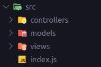

# Documento de arquitetura

## Introdução

Devido ao fato de que nossa API seguirá com o padrão REST, ficou decidido que o nosso projeto irá utilizar a arquitetura MVC (Model, View, Controller), esta arquitetura é uma das mais utilizadas no mercado devido ao fato de poder dividir melhor como funciona o software e pelo fato de que o padrão REST funciona bem com esta arquitetura.
O padrão REST é um conjunto de restrições de arquitetura, serve como um guia do que deve ou não ser feito em relação à API, rotas, dados e relações cliente/servidor, porém os desenvolvedores têm liberdade para adaptar e seguir o padrão como achar mais útil dentro do contexto da aplicação.
Abaixo segue um exemplo da arquitetura sendo utilizado no momento, sendo que esta pode ser alterada conforme o projeto avança.

 
figura 1. Fonte: Autoria própria

## Database

Este padrão armazena o que está relacionado ao funcionamento e conexão ao banco de dados, ao tornar o banco de dados independente do resto da aplicação, permitindo uma manutenção mais efetiva.

## Middleware

Este padrão emergente é muito utilizado no Express, A cada requisição feita à API, essa passa por uma sequência de middlewares presentes na rota solicitada, estes middlewares contém regras de negócio, caso o objeto atenda às condições do middleware, é passado para o próximo middleware a resposta deste, permanecendo assim até o fim de todos os middlewares, nesta aplicação, os principais middlewares de controle se localizam em controllers e em middlewares ficam aqueles que não se adequam ao padrão de controllers, no caso da aplicação, a verificação de tokens.

 
figura 2 Fonte: Autoria própria

Exemplo de middlewares:

 
figura 3. Fonte: Autoria própria
 
figura 4. Fonte: Autoria própria

## MVC

Esta arquitetura separa a apresentação da interação do sistema em diferentes estruturas, Model que é responsável por definir os dados e as operações com estes, View que é responsável pela apresentação desses dados ao usuário e Controller que é responsável por gerenciar a interação do usuário e passar estas interações para o Model e View 

Nossa aplicação seguirá o seguinte modelo:

 
figura 5. Fonte: Autoria própria
